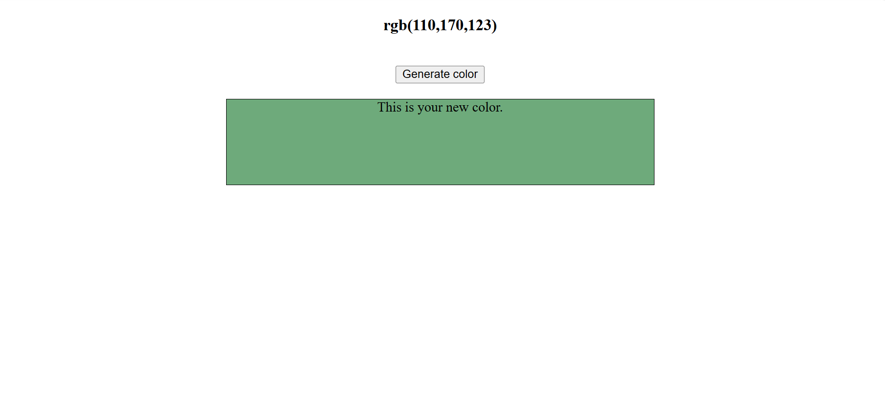

# 🎨 Random Color Generator

A simple web app that generates a random RGB color and displays it inside a box along with the color code.  
Built with **HTML, CSS, and JavaScript** as a fun beginner project.

---

## 🚀 Features
- Generates a random RGB color on button click  
- Displays the RGB code dynamically  
- Updates the background of the color box instantly  

---

## 📸 Screenshot
  

---

## 🛠️ How to Run
1. Clone the repository  
   ```bash
   git clone https://github.com/kanan-preet-kaur/random-color-generator.git

---

## 📬 Contact

- GitHub: [kanan-preet-kaur](https://github.com/kanan-preet-kaur)  
- LinkedIn: [Kanan Preet Kaur](https://www.linkedin.com/in/kanan-preet-kaur/)  

